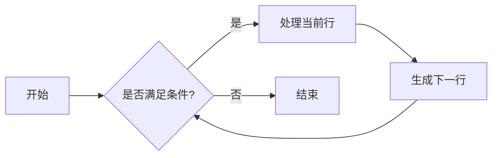

---
title: PostgreSQL CTE：SQL中的便利贴
date: 2025-03-23 23:31
tags:
  - SQL
  - PostgreSQL
  - Database
---

说到PostgreSQL的CTE（Common Table Expressions），我总觉得它就像SQL里的便利贴。你可以在查询的任何地方贴上一张，写上"待会儿要用这个"，然后继续往下写。是不是听起来比子查询要优雅多了？

让我们从一个简单的例子开始。假设我们有个员工表，想找出工资高于平均工资的员工：

```sql
WITH avg_salary AS (
  SELECT AVG(salary) AS avg FROM employees
)
SELECT * FROM employees
WHERE salary > (SELECT avg FROM avg_salary);
```

看到没？我们把计算平均工资的逻辑单独拎出来了。你可能会问，这和子查询有什么区别？区别就在于CTE可以复用，而且可读性更好。想象一下，如果你要在一个复杂查询里多次用到这个平均值，CTE其实就是救星。

不过CTE最酷的地方在于递归查询。来，我们画个简单的流程图：



这个流程图描述了一个典型的递归CTE结构。举个实际例子，假设我们要查询一个员工的所有下属：

```sql
WITH RECURSIVE subordinates AS (
  SELECT id, name, manager_id
  FROM employees
  WHERE id = 1  -- 从CEO开始

  UNION ALL

  SELECT e.id, e.name, e.manager_id
  FROM employees e
  INNER JOIN subordinates s ON s.id = e.manager_id
)
SELECT * FROM subordinates;
```

说实话，我第一次看到递归CTE的时候，脑子是懵的。但一旦理解了它的工作原理，就会发现它简直是个神器。不过要小心，递归查询很容易写出死循环，我就干过这种蠢事。

说到性能，CTE有时会被过度神话。很多人以为CTE会自动优化查询，其实不然。PostgreSQL会把CTE当作一个临时视图来处理，这意味着它可能会被多次执行。如果你发现查询变慢了，不妨试试把CTE改成子查询或者临时表。

最后说点个人偏见：我觉得CTE最大的价值不在于性能优化，而在于让SQL代码更易读、更易维护。毕竟，三个月后回头看代码的很可能就是你自己。与其写一堆让人头大的嵌套查询，不如用CTE把逻辑清晰地表达出来。